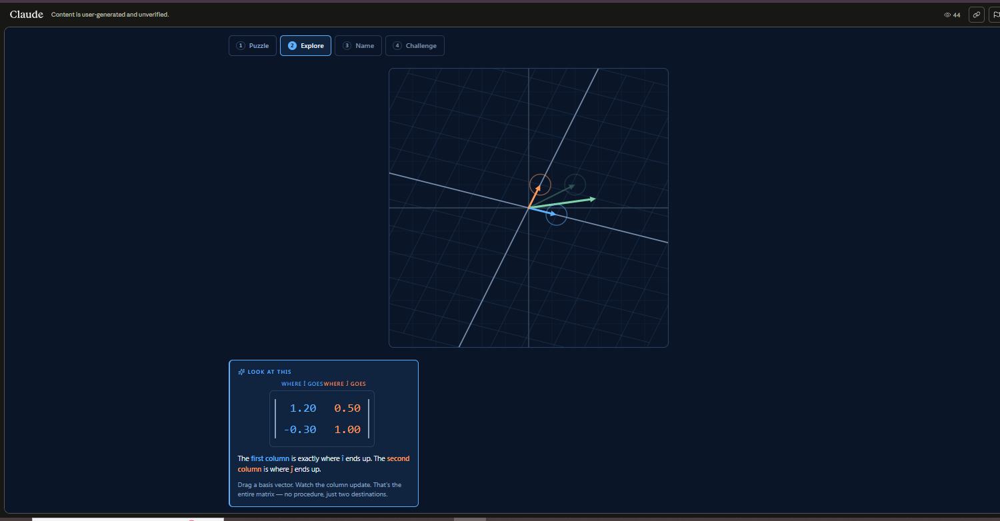

# Matrix Multiplication: Geometric Intuition

**One-line:** Reframe matrix-vector multiplication from "rows times columns" into "where do the basis vectors land."
**Try it:** [Live demo](https://claude.ai/public/artifacts/103ddfa5-116a-44db-ab10-8d50a7d70da7)
## The aha moment
A matrix is not a procedure, it is a recipe. Its two columns tell you exactly where î and ĵ get sent, and every other vector follows along because every vector was always just a combination of basis vectors. The "rows times columns" rule you memorized is the algebraic shadow of this geometric truth, not a separate fact.
## What's inside
- Drag the blue (î) and orange (ĵ) arrows on a 2D plane. The matrix entries and the warped grid update in real time, in both directions.
- Six preset transformations (rotate 90°, scale 2×, shear, reflect, squish, identity) reveal what each kind of matrix does to space.
- Final challenge: rotate an F-shape 45° clockwise by placing the basis vectors yourself. On success, a panel shows the same matrix applied to a data scatter, tying it directly to what one neural network layer does.
## Source
`matrix_multiplication.jsx` in this folder. Built with the [interactive-educator](https://github.com/Wamikmk/interactive-educator) skill.